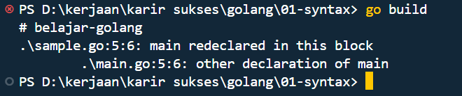

## package

pada go tidak harus semuanya menggunakan package main, itu tergantung pada tujuan file tersebut
penjelasan sederhana terkait package.

#### ✅ 1. Jika tujuan file adalah untuk dieksekusi langsung (aplikasi utama):

gunakan:

```
package main
```

- File ini harus memiliki fungsi func main().

- File seperti ini bisa dijalankan dengan go run namafile.go atau dibuild dengan go build.

Contoh:

```
package main

import "fmt"

func main() {
    fmt.Println("Hello, Go!")
}
```

#### ✅ 2. Jika file berisi fungsi, struct, atau utilitas (digunakan di file lain):

gunakan:

```
package nama_paket
```

- Biasanya digunakan untuk modularisasi kode, seperti package utils, package service, dll.

- File ini tidak perlu punya fungsi main().

- Contoh:

```
package utils

func SayHello(name string) string {
    return "Hello, " + name
}
```

Lalu dipanggil dari file main.go:

```
package main

import (
    "fmt"
    "namamodul/utils" // tergantung nama modul Go kamu
)

func main() {
    fmt.Println(utils.SayHello("Go"))
}
```

### go build

untuk mempercepat execute lakukan build pada code program.

perbedaannya bisa sangat signifikan ketika menjalankan program yang sudah di build dan belum.

contoh:
menjalankan dengan tanpa build bisa dengan:

```
go run nama_file.go
```

dengan build:

- pertama jalankan dulu
  `go build`
- setelah itu caranya langsung ketik ./ dan tab nanti muncul nama project yang dibuild lalu enter maka akan keluar hasilnya.

#### bagaimana berbeda kan waktu eksekusinya?

noted: untuk build itu wajib ketika project selesai untuk mengcompilasi code program ke binary file.

### multiple main function

- di golang nama function itu unik (tidak boleh ada yang sama)
- maka ketika membuat function di file yang baru tidak boleh sama
- contoh ketika membuat function main di main.go dan membuat function main di file sample.go maka tidak bisa dan tidak akan bisa di build karena duplicate

pada saat di build akan error seperti ini:

