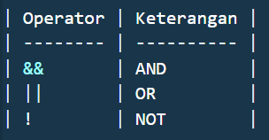

## Operator

pada golang operator digunakan untuk melakukan operasi terhadap nilai, atau variabel seperti penjumlahan, perbandingan, atau logika.

Operator ini jadi bagian penting dari logika program, karena akan sering kita gunakan saat membuat kondisi, perhitungan, dan kontrol alur.

berikut jenis-jenis operator di golang:

### 1. Operator Aritmatika

operator ini digunakan untuk operasi matematika dasar.

| Operator | Keterangan          |
| -------- | ------------------- |
| +        | Penjumlahan         |
| -        | Pengurangan         |
| \*       | Perkalian           |
| /        | Pembagian           |
| %        | Modulus (sisa bagi) |

contoh:

```
a := 10;
b := 3;
fmt.Println(a + b) // output: 13
fmt.Println(a % b) // output: 1
```

### 2. Operator Perbandingan.

Operator ini menghasilkan nilai boolean (true atau false) berdasarkan perbandingan dua nilai.

| Operator | Keterangan        |
| -------- | ----------------- |
| ==       | sama dengan       |
| !=       | tidak sama dengan |
| >        | lebih besar       |
| <        | lebih kecil       |
| >=       | lebih besar/sama  |
| <=       | lebih kecil/sama  |

noted:
di golang tidak ada operator === dan !== seperti pada pemrograman lain contohnya pada javascript atau pada php.

contoh Js.

```
'5' == 5     // true   (tipe beda tapi nilainya sama)
'5' === 5    // false  (tipe dan nilai beda)
```

🧠 Di Go, Hal Itu Tidak Bisa Terjadi
Karena:

Go tidak memperbolehkan perbandingan antar dua tipe berbeda.

Bahkan sebelum dibandingkan, kodenya tidak akan bisa dikompilasi kalau a dan b beda tipe.

contoh di go.

```
var a int = 5
var b string = "5"

fmt.Println(a == b)  // ❌ compile error: mismatched types int and string
```

### 3. Operator Logika

digunakan untuk menggabungkan kondisi boolean.


