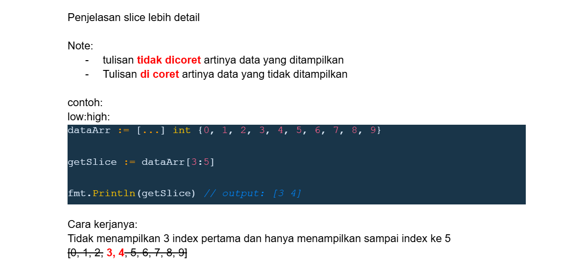
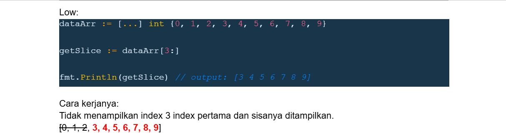
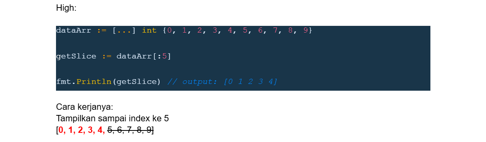
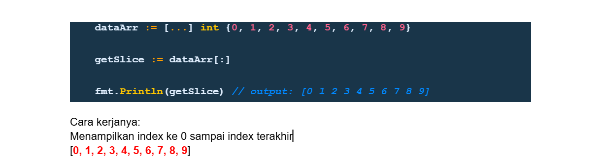

# tipe data slice

- slice merupakan tipe data potongan dari tipe data array
- yang membedakan slice dengan array adalah ukuran slice bisa berubah
- slice dan array selalu terkoneksi, dimana slice adalah data yang mengakses sebagian atau seluruh data di array.

| Membuat Slice   | Keterangan                                                             |
| --------------- | ---------------------------------------------------------------------- |
| array[low:high] | Membuat slice dari array dimulai index low sampai index sebelum high   |
| array[low:]     | Membuat slice dari array dimulai index low sampai index akhir di array |
| array[high:]    | Membuat slice dari array dimulai index 0 sampai index sebelum high     |
| array[:]        | Membuat slice dari array dimulai index 0 sampai index akhir di array   |

